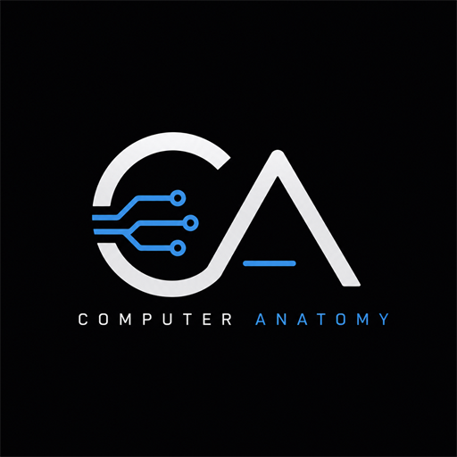

This is a [Next.js](https://nextjs.org) project bootstrapped with [`create-next-app`](https://nextjs.org/docs/app/api-reference/cli/create-next-app).

## Getting Started

First, run the development server:

```bash
npm run dev
# or
yarn dev
# or
pnpm dev
# or
bun dev
```

Open [http://localhost:3000](http://localhost:3000) with your browser to see the result.

You can start editing the page by modifying `app/page.tsx`. The page auto-updates as you edit the file.

This project uses [`next/font`](https://nextjs.org/docs/app/building-your-application/optimizing/fonts) to automatically optimize and load [Geist](https://vercel.com/font), a new font family for Vercel.

## Learn More

To learn more about Next.js, take a look at the following resources:

- [Next.js Documentation](https://nextjs.org/docs) - learn about Next.js features and API.
- [Learn Next.js](https://nextjs.org/learn) - an interactive Next.js tutorial.

You can check out [the Next.js GitHub repository](https://github.com/vercel/next.js) - your feedback and contributions are welcome!

## Deploy on Vercel

The easiest way to deploy your Next.js app is to use the [Vercel Platform](https://vercel.com/new?utm_medium=default-template&filter=next.js&utm_source=create-next-app&utm_campaign=create-next-app-readme) from the creators of Next.js.

Check out our [Next.js deployment documentation](https://nextjs.org/docs/app/building-your-application/deploying) for more details.
<div align="center">



# Computer Anatomy

### Learn Computer Hardware Like Never Before.

An open-source interactive learning platform that helps students, educators, and enthusiasts understand computer hardware through immersive 3D visualization, educational animations, and hands-on exploration.

<p>

[](https://computeranatomy.dev)
[](#documentation)
[]
[]
[]

</p>

</div>

---

```bash
$ npx computer-anatomy

Initializing Learning Environment...

Loading Hardware Database...
Loading 3D Engine...
Loading Components...
Preparing Interactive Experience...

✓ Ready.

Welcome to Computer Anatomy.
```

---

# Overview

Computer Anatomy is a modern educational platform that transforms traditional computer hardware learning into an immersive interactive experience.

Instead of reading static diagrams, users can explore realistic 3D hardware models, inspect internal components, watch educational animations, and understand how every part works together inside a computer.

Whether you're a student, educator, PC builder, or technology enthusiast, Computer Anatomy provides an engaging way to learn modern computer architecture.

---

# Why Computer Anatomy?

Traditional learning often relies on textbooks and images.

Computer Anatomy allows you to:

- Explore computer hardware in 3D
- Understand internal architecture visually
- Learn through interaction instead of memorization
- See how components communicate
- Build practical hardware knowledge

---

# Features

## Current Features

- Interactive Landing Page
- Modern User Interface
- Responsive Design
- Hardware Information Pages
- Educational Content
- Smooth Animations
- Open Source

---

## Planned Features

- Interactive Motherboard
- CPU Exploration
- RAM Visualization
- GPU Anatomy
- Storage Devices
- Power Supply
- Data Flow Animations
- Exploded Computer View
- Hardware Comparison
- Interactive Quizzes
- Progress Tracking
- AI Learning Assistant
- Search Components
- Dark / Light Theme
- Multi-language Support
- Mobile PWA

---

# Screenshots

| Landing Page | Hardware Explorer |
|--------------|------------------|
| Coming Soon | Coming Soon |

| Component Viewer | Educational Mode |
|------------------|------------------|
| Coming Soon | Coming Soon |

---

# Live Demo

Website

```
https://computeranatomy.dev
```

Documentation

```
https://computeranatomy.dev/docs
```

Roadmap

```
https://computeranatomy.dev/roadmap
```

---

# Tech Stack

## Frontend

- Next.js
- React
- TypeScript
- Tailwind CSS

## Animation

- Framer Motion
- GSAP
- Lenis

## 3D

- Three.js
- React Three Fiber
- Drei

## Development

- ESLint
- Prettier
- Husky

## Deployment

- Vercel

---

# Project Structure

```text
computer-anatomy/

├── app/
│
├── components/
│   ├── common/
│   ├── ui/
│   ├── layout/
│   └── sections/
│
├── features/
│   ├── motherboard/
│   ├── cpu/
│   ├── ram/
│   ├── gpu/
│   ├── storage/
│   ├── psu/
│   └── cooling/
│
├── three/
│
├── hooks/
│
├── lib/
│
├── utils/
│
├── types/
│
├── styles/
│
├── docs/
│
├── public/
│
├── README.md
│
└── LICENSE
```

---

# Getting Started

Clone the repository.

```bash
git clone https://github.com/yourusername/computer-anatomy.git
```

Navigate into the project.

```bash
cd computer-anatomy
```

Install dependencies.

```bash
npm install
```

Start the development server.

```bash
npm run dev
```

Open your browser.

```
http://localhost:3000
```

---

# Available Scripts

```bash
npm run dev
```

Runs the development server.

---

```bash
npm run build
```

Creates a production build.

---

```bash
npm run start
```

Starts the production server.

---

```bash
npm run lint
```

Runs ESLint.

---

```bash
npm run typecheck
```

Runs TypeScript checking.

---

```bash
npm run format
```

Formats code using Prettier.

---

# Environment Variables

Create a `.env.local` file.

```env
NEXT_PUBLIC_APP_URL=

NEXT_PUBLIC_SUPABASE_URL=

NEXT_PUBLIC_SUPABASE_ANON_KEY=
```

---

# Documentation

Documentation is currently under development.

Future documentation will include:

- Installation
- Components
- 3D System
- Educational API
- Contributing Guide
- Design System

---

# Roadmap

## Phase 1

- Landing Page
- Hero Section
- Responsive UI
- Documentation

## Phase 2

- Motherboard Module
- CPU Module
- RAM Module
- GPU Module
- Storage Module

## Phase 3

- Interactive 3D Viewer
- Exploded View
- Educational Animations
- Search System

## Phase 4

- AI Tutor
- Quizzes
- Learning Progress
- Achievements
- Certificates

---

# Contributing

We welcome contributions from developers, designers, educators, and hardware enthusiasts.

1. Fork the repository
2. Create a feature branch
3. Commit your changes
4. Push your branch
5. Open a Pull Request

Please read **CONTRIBUTING.md** before contributing.

---

# Code of Conduct

This project follows an open and welcoming community.

Please read **CODE_OF_CONDUCT.md** before participating.

---

# Security

If you discover a security vulnerability, please report it privately.

Do **not** open a public issue.

Contact:

```
security@computeranatomy.dev
```

---

# Community

Join the community.

- GitHub Discussions
- Discord
- Issues
- Feature Requests

---

# Open Source

Computer Anatomy is completely open source.

Everyone is welcome to contribute regardless of experience.

Whether you're fixing typos, improving documentation, building new features, or reporting bugs, every contribution helps make computer education more accessible.

If you enjoy this project, consider giving it a ⭐ on GitHub.

---

# Browser Support

- Chrome
- Edge
- Firefox
- Safari

---

# Performance Goals

- Lighthouse 100
- Responsive
- Accessible
- SEO Optimized
- GPU Accelerated
- 60 FPS Animations

---

# Accessibility

Computer Anatomy is committed to accessibility.

Goals include:

- Keyboard Navigation
- Screen Reader Support
- Reduced Motion
- High Contrast
- Semantic HTML

---

# Acknowledgements

Special thanks to the amazing open-source community.

Built with:

- Next.js
- React
- Three.js
- React Three Fiber
- Drei
- Tailwind CSS
- Framer Motion
- GSAP
- Vercel

---

# License

Released under the MIT License.

See the LICENSE file for more information.

---

<div align="center">

## Learn. Explore. Build.

Made with ❤️ by the Computer Anatomy Community.

If this project helped you, consider giving it a ⭐ on GitHub.

</div>